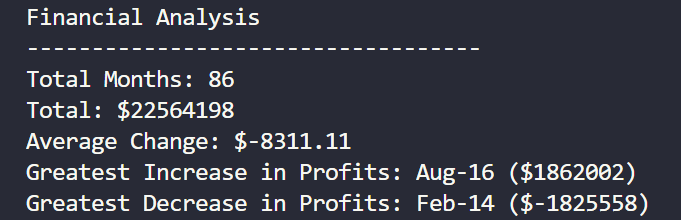
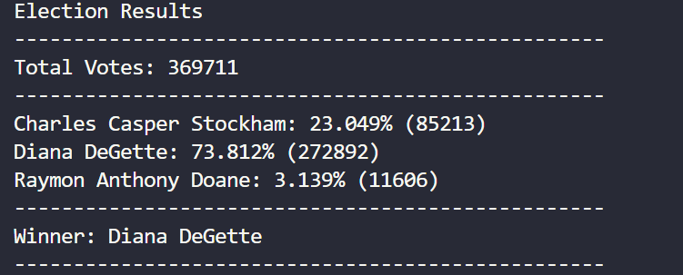

# python-challenge

## PyBank - Analyse the financial record of your comapny

This Python script is designed to analyze the financial records of a company using the provided dataset called 'budget_data.csv'. The dataset contains two columns: "Date" and "Profit/Losses". The script calculates various financial metrics such as total months, net total amount of profit/losses, average change, greatest increase in profits, and greatest decrease in profits over the entire period.

### What do you need?

- Python 3.x
- budget_data.csv (provided dataset)

  - Create 'Resources' folder in the main directory and place csv file in the resources folder

### How to use the code?

- Ensure that 'budegt_data.csv' is placed in the 'Resources' folder as mentioned above
- Run the script by executing 'python main.py' in the command line
- Script will print the analysis result to the terminal and export it to the 'output.txt' file in 'Analysis' folder in main project directory

### Expected Results

## PyPoll - helping a small, rural U.S. town modernise its vote-counting process.

This Python script assists a small, rural U.S. town in modernizing its vote-counting process using the provided dataset called 'election_data.csv'. The dataset consists of three columns: "Voter ID", "County", and "Candidate". The script calculates various election metrics such as total votes cast, list of candidates who received votes, percentage of votes each candidate won, total number of votes each candidate won, and the winner of the election based on popular vote.

### What do you need?

- Python 3.x
- election_data.csv (provided dataset)

  - Create 'Resources' folder in the main directory and place csv file in the resources folder

### How to use the code?

- Ensure that 'election_data.csv' is placed in the 'Resources' folder as mentioned above
- Run the script by executing 'python main.py' in the command line
- Script will print the analysis result to the terminal and export it to the 'output.txt' file in 'Analysis' folder in main project directory

### Expected Results

